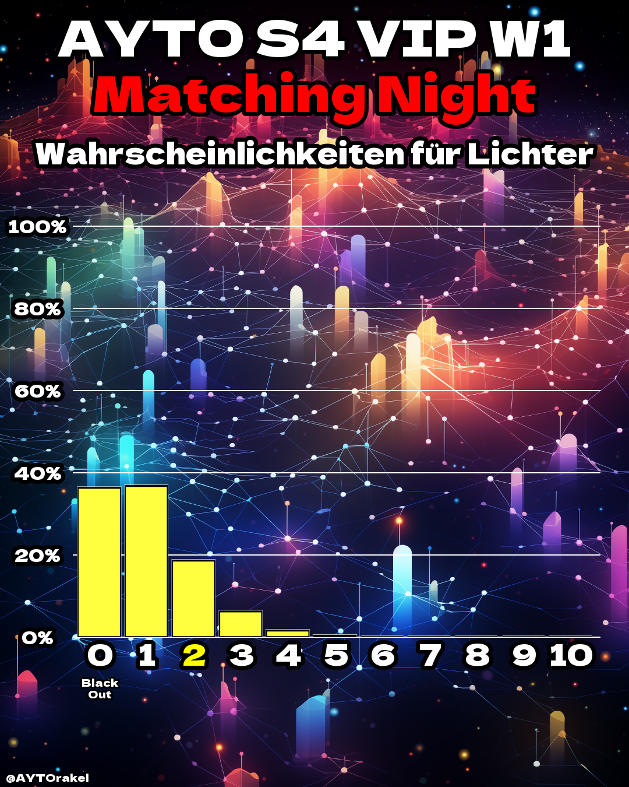

# AYTOrakel

**AYTOrakel** is a Python project that analyzes and visualizes match probabilities and light probabilities for the German RTL show *"Are You The One?"* (AYTO). The project processes data from the show, generates all possible match combinations, and updates probabilities based on events from each week. 

|  |  |
|:----------------------:|:----------------------:|
| Probabilities for the Light Count before the 1st Matching Night |  Matching Probabilites after the 3rd Matching Night |

*Note: To be a bit more precise, the calculated probabilities state the probability that participant X wins with participant Y in the final matching night (for that, they need to be a perfect match). But, e.g., with a double match, the probability for each member is 50:50 to be selected in the final night.*

## 📱 Follow @AYTOrakel on Instagram
The predictions are updated after each episode on Instagram. \
[Follow AYTOrakel on Instagram](https://www.instagram.com/AYTOrakel) to stay up to date and join the discussions. \
[Check out the AYTO-Strategies Repo on Github](https://github.com/jjccmm/AYTO-Strategies) to learn about the best ways to solve AYTO. 


## 🙏 Acknowledgements

This project uses data from the RTL show *"Are You The One?"* and various Python libraries for data processing and visualization. Special thanks to the developers of these libraries for their contributions to the open-source community. All images from the participants of the show belong to RTL. 


## 📂 Project Structure

- **`ayto_data.json`**: Contains data for the AYTO seasons.
- **`aytorakel.py`**: Main script for processing and visualizing match probabilities.
- **`insta_styles/`**: Directory containing images and fonts for styling the instagrm posts.
- **`requirements.txt`**: List of dependencies required for the project.
- **`"seasons"/`**: Directory containing generated images and data for the season.
- **`explanation/`**: Directory containing images explaning the method for the predictions.


## 🚀 Usage
1. Install requirements
```bash
    pip install -r requirements.txt
```
2. Ensure that the `ayto_data.json` file contains the correct data for the season you want to analyze.
3. Set in `aytorakel.py` the season you want and if a video/reel should get generated
```bash
    season = 's4vip'
    save_reel = True
```
4. If you want to generate the reel, you need to install ffmpeg and set the path in `aytorakel.py`
5. Run the main script:

```bash
    python aytorakel.py
```

This will generate all possible match combinations, update probabilities based on events, and save visualizations in the `s4vip` directory.


